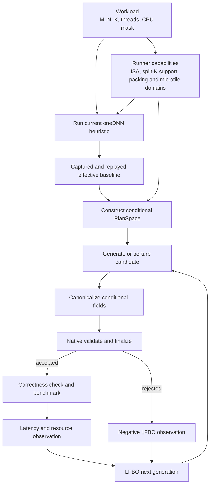
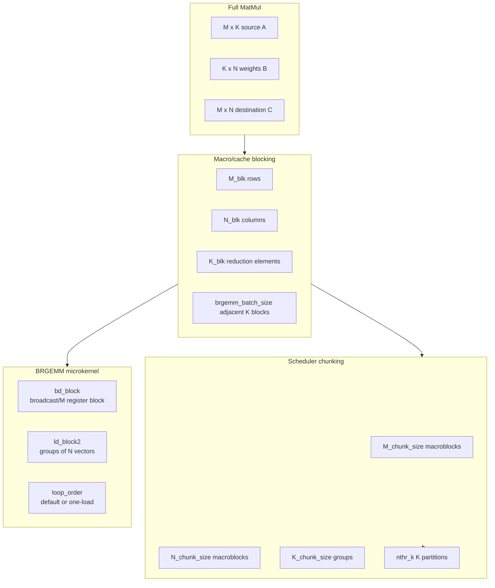
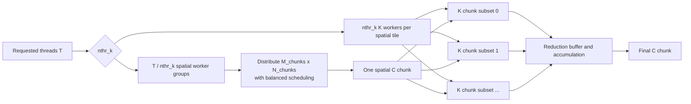
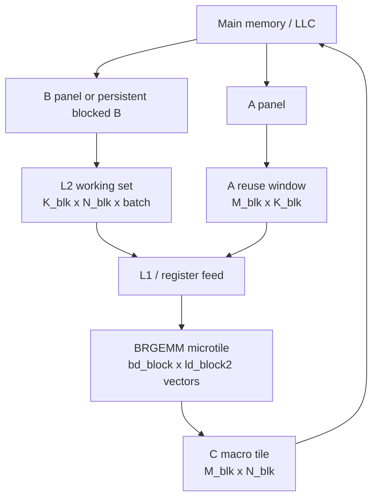
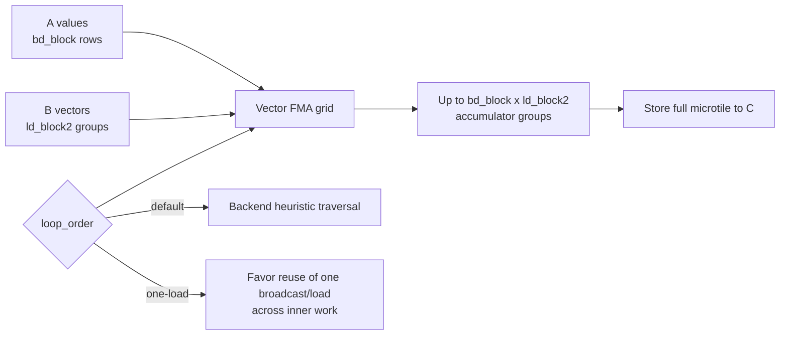
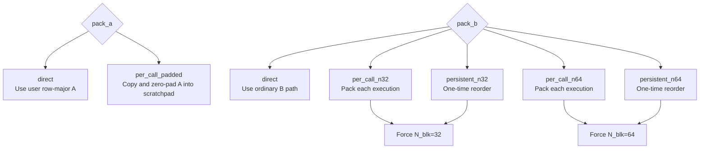
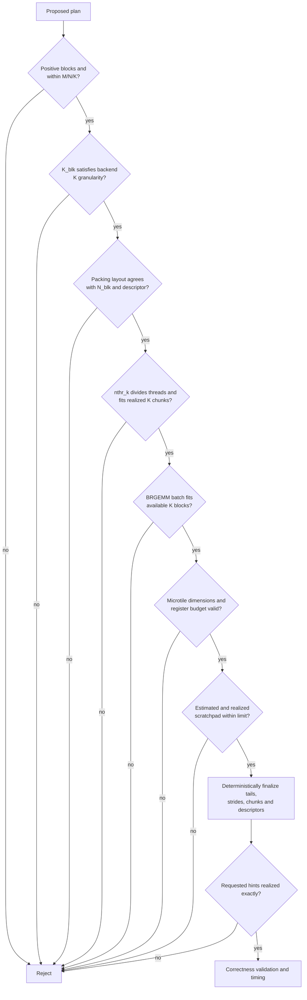

# MatOpt MatMul Search Space

This document describes the search space implemented by the standalone MatOpt
tuner and the oneDNN v3.12.2 MatOpt patch. It is specific to batch-1, dense
row-major FP32 matrix multiplication

```text
C[M,N] = A[M,K] * B[K,N]
```

with `alpha=1`, `beta=0`, a fixed thread count, and an explicit Linux CPU
mask. The target backends are x64 BRGEMM and AArch64 BRGEMM. The ordinary
oneDNN heuristic remains the source of the runtime baseline.

The search space is mixed discrete and conditional. A plan is not simply the
Cartesian product of independent integers: packing choices constrain block
sizes, thread partitioning depends on the number of K chunks, microtiles are
limited by register pressure, and the native runner may reject a proposal
after architecture-specific finalization.

## Search-space construction

Every tuning session starts by asking the native runner to construct and
benchmark the ordinary oneDNN MatMul primitive. Its realized configuration is
replayed through the explicit-plan path and returned as `effective_plan`.
Python then constructs a `PlanSpace` from:

1. the workload dimensions and requested threads;
2. the runtime baseline;
3. capability domains reported by the exact runner build; and
4. a deliberately small set of architecture-neutral alternatives.



The baseline is therefore dynamic across workloads, machines, thread counts,
ISAs, oneDNN revisions, and patch builds. It is fixed within one tuning
session. LFBO's best observed plan changes over time, but the captured baseline
does not.

The baseline value is included in every ordered domain even when it is outside
the hand-selected alternatives. This preserves oneDNN expertise and ensures
that the tuner can search locally around a configuration that is unusual but
appropriate for a particular shape or processor.

## Three blocking levels

MatOpt exposes three related but different blocking levels.



- **Macro blocks** define the M/N/K region consumed by a normal BRGEMM
  descriptor and strongly influence cache footprint, tail work, and packing.
- **Scheduler chunks** group one or more macroblocks into units distributed
  among threads. They trade scheduling parallelism for reuse and reduced
  driver overhead.
- **Microkernel blocks** determine how a full BRGEMM tile is held and traversed
  in vector registers. They do not replace macroblocking.

Tail descriptors retain oneDNN's normal heuristics. Explicit `bd_block`,
`ld_block2`, and `loop_order` hints apply only to the full-M, full-N, full-K
descriptor.

## Current tunable fields

| Field | Current domain | Layer | Primary effect |
|---|---:|---|---|
| `M_blk` | baseline plus 64, 96, 128, 160, 192, 224, 256 | cache | A/C footprint, M tails, spatial work |
| `N_blk` | baseline plus 32, 64 | cache/layout | B/C footprint, N tails, blocked-B format |
| `K_blk` | baseline plus 256, 512, 1024 | cache/reduction | A/B panels, K tails, BRGEMM work |
| `N_chunk_size` | baseline plus 1, 2, 4, 8 | scheduler | adjacent N blocks per scheduled chunk |
| `brgemm_batch_size` | baseline plus 1, 2, 4 | reduction | K blocks submitted in one BRGEMM batch |
| `nthr_k` | baseline plus 1, 2, 4 when split-K is advertised; otherwise 1 | scheduler | split-K parallelism and reduction buffers |
| `pack_a` | `direct`, `per_call_padded` | data movement | direct A access versus padded execution buffer |
| `pack_b` | direct, per-call n32/n64, persistent n32/n64 | data movement/layout | B reuse, reorder/copy cost, blocked N |
| `bd_block` | 0, 4, 5, 6, 7 | kernel | M/broadcast rows held by the microkernel |
| `ld_block2` | 0, 2, 3, 4 | kernel | number of N vector blocks grouped together |
| `loop_order` | `default`, `one-load` | kernel | register-loop traversal and load reuse |

`0` for a microtile field means “use the kernel's existing heuristic,” not a
zero-sized tile. The realized values are reported separately as
`realized_bd_block` and `realized_ld_block2`.

M/N/K block alternatives larger than their corresponding workload dimension
are removed during Python space construction. Thread divisibility and the
number of available K chunks are checked authoritatively by the native runner;
therefore not every proposed x64 `nthr_k` value is legal for every workload.

The plan schema also contains `M_chunk_size` and `K_chunk_size`, but the current
Python `PlanSpace` does not vary them:

- `M_chunk_size` is inherited from the runtime baseline;
- `K_chunk_size` is inherited and currently captured as 1 by this vector
  BRGEMM path.

This distinction matters for experiment analysis: a field being serializable
does not mean it is currently part of the searched domain.

## Thread blocking and scheduling

For batch 1, spatial work consists of M/N chunks:

```text
M_chunk_elems = M_blk * M_chunk_size
N_chunk_elems = N_blk * N_chunk_size
M_chunks = ceil(M / M_chunk_elems)
N_chunks = ceil(N / N_chunk_elems)
spatial_work = M_chunks * N_chunks
```

The driver divides the requested threads into a spatial group and, when
enabled, a K-reduction group:

```text
nthr_bmn = threads / nthr_k
```

Each spatial worker receives M/N chunks using oneDNN's balanced scheduling.
Each of its `nthr_k` partners receives a subset of K chunks. Split-K results
are accumulated through per-thread reduction buffers before the final C tile
is complete.



`nthr_k` must divide the requested thread count and cannot exceed the realized
number of K chunks. On AArch64 it is currently fixed to 1 because repeated
multithreaded tuning exposed a split-K crash in the upstream execution path.
The native runner advertises `allow_split_k=false` and rejects an explicit
`nthr_k>1`; Python therefore constructs only the singleton domain `[1]`.

Larger `N_chunk_size` assigns more neighboring N macroblocks to one scheduled
unit. This can reuse A and amortize scheduling or packing overhead, but it
reduces the number of independent spatial units. Values 1, 2, 4, and 8 cover
successive powers of two without creating a large, redundant integer domain.

The native reference generator rejects distant candidates when

```text
spatial_work * min(nthr_k, K_chunks) * 2 < threads
```

because they provide too little parallel work to keep the requested threads
occupied. The standalone LFBO path may still propose a weak or invalid
combination; the runner remains authoritative and the rejection becomes a
negative training observation.

## Cache blocking

For FP32, the principal panel sizes of a macro operation are approximately:

```text
A panel = M_blk * K_blk * 4 bytes
B panel = K_blk * N_blk * 4 bytes
C tile  = M_blk * N_blk * 4 bytes
```

When BRGEMM batches several K blocks, the active B reduction footprint grows
approximately with `brgemm_batch_size`. Packing and split-K add scratchpad
footprints:

```text
per-call padded A ~= M_blk * K_blk * 4
per-call packed B ~= K_blk * N_blk * brgemm_batch_size * 4
split-K C buffer  ~= M_blk * N_blk * 4
```

These are early estimates. The finalized oneDNN primitive descriptor is the
authority for actual scratchpad size, and plans above 64 MiB per requested
thread are rejected. The finalized primitive is additionally checked against a
total limit of 64 MiB multiplied by the requested thread count.



The current ranges intentionally span a few cache regimes rather than trying
every multiple:

- `M_blk=64..256` changes the A/C footprint and the number of M work units in
  moderate 32-row increments. Blocks above 256 quickly reduce spatial
  parallelism and increase A/C footprint for the MVP target shapes.
- `N_blk=32 or 64` matches the two blocked-B layouts exposed by the patch. On
  AVX-512 FP32 these represent two or four 16-float vectors; on SVE256 they
  represent four or eight 8-float vectors. They are large enough to reuse A
  while remaining practical for register blocking.
- `K_blk=256,512,1024` spans increasing reduction reuse and packing
  amortization at power-of-two boundaries. Smaller K blocks create more driver
  and BRGEMM-batch overhead; larger values can overfill private caches and
  leave too few K chunks for split-K.
- `brgemm_batch_size=1,2,4` changes how many adjacent K blocks are submitted
  together. Powers of two expose the major overhead/reuse tradeoff while
  keeping batch metadata and packed-B scratchpad bounded.

The runtime baseline is always added, so these explanations are guardrails,
not claims that the listed values are universally optimal.

### Tail cost

For a dimension that is not evenly divisible by its block, the reference
generator uses:

```text
tail_penalty(D, block) = 1 - (D mod block) / block
```

This measures how much of the final nominal block is unused. Distant
Cartesian candidates with aggregate M/N/K tail penalty above 2.25 are pruned
by the native reference generator. Baseline and one-field mutations are kept
to avoid hiding a useful interaction behind an overly aggressive model.

## Kernel blocking

For FP32 BRGEMM, `bd_block` controls the broadcast/M dimension and
`ld_block2` groups vector-width blocks along N. Their product is a useful
first-order proxy for accumulator-register pressure:

```text
accumulator groups ~= bd_block * ld_block2
```

MatOpt rejects an explicit pair whose product exceeds 28. The backend also
checks the requested values against the actual full descriptor dimensions and
the architecture's BRGEMM blocking rules.



The ranges `bd_block={4,5,6,7}` and `ld_block2={2,3,4}` focus on useful
multi-row, multi-vector tiles while respecting the 28-product budget. They
also bracket the choices commonly made by the vector BRGEMM heuristics without
expanding into many tiny tiles that are usually dominated by loop overhead.
The `0` sentinel keeps the backend heuristic in the experiment and is
especially important for tails and unusual dimensions.

`one-load` is a narrow loop-order alternative supported by both patched vector
backends. It can improve reuse for some register shapes but may worsen another
dimension's access order, so it is measured rather than assumed.

## Packing and layout choices



`per_call_padded` A can remove unfavorable source strides, satisfy padded
kernel access, and avoid power-of-two leading-dimension pathologies. It costs
a copy on every execution. The AArch64 patch uses a bounded native row-copy
fallback for this dense FP32 policy because the upstream SVE copy-A JIT is
unfinished in oneDNN v3.12.2.

Per-call B policies use oneDNN's execution scratchpad and copy kernel on every
MatMul call. Persistent policies instead require the caller to reorder B once
into the primitive descriptor's blocked weights format. Thus:

- one-shot latency includes the persistent reorder;
- steady-state latency moves persistent reorder outside the timed loop;
- per-call packing remains inside both measurements.

The n32/n64 suffix is a layout contract, not a suggestion. Canonicalization
forces the corresponding `N_blk`, and the runner rejects any mismatch. This
means raw Cartesian cardinality overstates the number of distinct legal
plans.

## Conditional validity and finalization

A proposal must pass all of the following classes of checks:



The tuner never silently substitutes a different explicit plan. A candidate is
accepted only if the requested controls survive finalization and the numerical
result agrees with the default primitive.

## Search-space size and LFBO representation

Ignoring baseline-only extra values and conditional equivalences, the largest
x64 raw product is roughly:

```text
8 M blocks
* 3 N blocks
* 4 K blocks
* 5 N chunk sizes
* 4 BRGEMM batch sizes
* 4 nthr_k values
* 2 A policies
* 5 B policies
* 5 bd_block values
* 4 ld_block2 values
* 2 loop orders
= 3,072,000 raw combinations
```

The legal space is much smaller after dimension bounds, thread divisibility,
packing canonicalization, K-chunk limits, microtile checks, and scratchpad
limits. It is still too large and irregular for exhaustive benchmarking.

LFBO encodes ordered fields by normalized domain index and categorical fields
with one-hot vectors. Its neighborhood operator changes between one and
`radius` fields; ordered fields move only a bounded number of domain indices,
while categorical fields may switch category. Rejected, incorrect, crashed,
and timed-out plans are retained as negative classifier observations. This
lets the optimizer learn both performance and much of the feasible boundary
without duplicating backend-private validation in Python.

## Why the current space is deliberately narrow

The MVP search space follows five principles:

1. **Retain the runtime baseline as evidence.** The oneDNN heuristic is always
   measured for comparison. It remains eligible in the built-in space, while
   an explicit strict domain may exclude it from search and selection.
2. **Expose controls with large expected effects.** Macro blocks, packing,
   spatial chunking, split-K, and register tiles materially change reuse,
   parallelism, or data movement.
3. **Use sparse, interpretable domains.** Powers of two and a small number of
   nearby M/register values reveal regime changes without spending most of the
   budget distinguishing adjacent integers.
4. **Keep mechanism in the native backend.** Python proposes policy; oneDNN
   validates K granularity, descriptors, tails, scratchpad, and realized
   microtiles.
5. **Avoid unvalidated controls.** Prefetch distances, non-temporal access,
   `rd_block`, and other JIT details remain outside the space until exact
   realization and correctness can be checked.

## Configurable search space

The standalone tuner implements a versioned `SpaceConfig`, while preserving
runner capabilities as an upper bound:

```yaml
space_schema_version: 1
inherit_baseline: false
domains:
  M_blk: {values: [64, 96, 128, 160, 192, 224, 256, 320]}
  N_blk: {values: [32, 64]}
  K_blk: {values: [128, 256, 512, 1024]}
  M_chunk_size: {values: [1, 2, 4]}
  N_chunk_size: {values: [1, 2, 4, 8]}
  brgemm_batch_size: {values: [1, 2, 4]}
  nthr_k: {values: [1, 2, 4], require_capability: allow_split_k}
conditions:
  - if: {pack_b: [per_call_n32, persistent_n32]}
    force: {N_blk: 32}
  - if: {pack_b: [per_call_n64, persistent_n64]}
    force: {N_blk: 64}
limits:
  scratchpad_per_thread_bytes: 67108864
  minimum_parallel_work_per_thread: 0.5
```

Configuration may narrow or extend the numeric plan fields implemented by the
current schema. Runner-reported categorical and microtile domains remain hard
upper bounds. Unknown fields, unsupported enum values, and domains that
contradict the runner fail before tuning. The canonical effective space and
relevant capability response are part of the history fingerprint, so resume
cannot silently change spaces.

Use it with:

```text
matopt-tuner tune ... --space-config examples/space_config.yaml
```

Configured domains replace the built-in list for that field; unspecified
fields retain their built-in domains. Explicit domains are strict by default:
an out-of-domain runtime baseline remains in the report as a comparison, but
does not seed the optimizer, enter the Pareto set, or remain eligible for final
selection. With `inherit_baseline: true`, its value is added to every explicitly
configured domain. Values larger than M/N/K, non-divisors of the requested
thread count, and BRGEMM batch sizes that cannot fit any configured K block are
removed during construction. An empty effective domain is an error.

The runner-reported categorical and microtile domains are hard upper bounds.
`scratchpad_per_thread_bytes` may only narrow the runner's limit.
`minimum_parallel_work_per_thread` prunes candidates whose estimated spatial
and K work divided by the requested threads falls below the configured ratio.
These Python checks save evaluations; native finalization remains authoritative.

The result JSON stores the requested configuration, effective domains, limits,
and a `space_hash`. For explicit configurations the append-only history uses a
composite identity derived from the native runner fingerprint and that space
hash. Changing a domain, condition, limit, or relevant capability therefore
rejects resume instead of silently continuing a different experiment.

### Extension classes

| Extension | Python-only policy change? | Native patch work required? |
|---|---|---|
| Add more values for existing realized M/N/K blocks | Usually | Only if backend limits reject them |
| Expand `M_chunk_size` ranges | Yes | The apply seam is supported; each new range still needs target validation |
| Tune `K_chunk_size` | No | Yes; current vector capture/realization fixes it to 1 |
| Restore AArch64 `nthr_k>1` | No | Yes; fix and validate split-K execution first |
| Add new persistent B block formats | No | Yes; descriptor/reorder and layout validation |
| Add cache-aware generated domains | Yes | No, if values remain within reported capabilities |
| Add `rd_block` or reduction unroll | No | Yes; JIT hint, register validation, descriptor capture |
| Add prefetch distance or policy | No | Yes; JIT/driver mechanism and measurement semantics |
| Add non-temporal loads/stores | No | Yes; kernel mechanism and cache-coherency validation |
| Tune explicit `nthr_m/n` decomposition | No | Yes; driver scheduling and reduction ownership |
| Add BF16/AMX or quantized types | No | Yes; new workload schema, layouts, correctness tolerances, and domains |

### Cache-derived domains

A future policy can generate candidate blocks from reported private-cache
sizes rather than only fixed lists. For example, it could retain values whose
estimated active panels fit target fractions of L1 or L2:

```text
A_panel + B_panel + C_tile <= target_cache_fraction * cache_bytes
```

Such formulas should generate candidates, not assert validity or performance.
Associativity, concurrent thread occupancy, hardware prefetch, packed strides,
and shared-cache contention make simple capacity models imperfect. The runtime
baseline and measured observations must remain in the loop.

### Shape-conditional domains

The configurable space should support shape families without reusing measured
plans across incompatible fingerprints:

- tall-skinny shapes can emphasize larger M chunks and smaller N blocks;
- short-wide shapes can expose larger N chunk groups and persistent B;
- large-K shapes can expand K blocks and split-K choices;
- small matrices can collapse the space to blocks no larger than dimensions
  and avoid packing whose copy cost cannot be amortized.

These are proposal priors, not hard-coded selections. Every final plan remains
workload-specific and must be validated by the native runner.

## Implementation references

- Python space construction and encoding:
  `matopt-tuner/src/matopt/space.py`
- LFBO neighborhood and observations:
  `matopt-tuner/src/matopt/search/lfbo.py`
- Native plan validation and reference candidate generation:
  `oneDNN/tools/matopt/matopt_core.cpp`
- Native override, finalization capture, and packing relationships:
  `oneDNN/src/cpu/matmul/matopt_backend.hpp`
- x64 and AArch64 BRGEMM MatMul scheduling:
  `oneDNN/src/cpu/{x64,aarch64}/matmul/brgemm_matmul.cpp`
- Architecture BRGEMM microtile validation:
  `oneDNN/src/cpu/{x64,aarch64}/brgemm/brgemm_utils.cpp`
